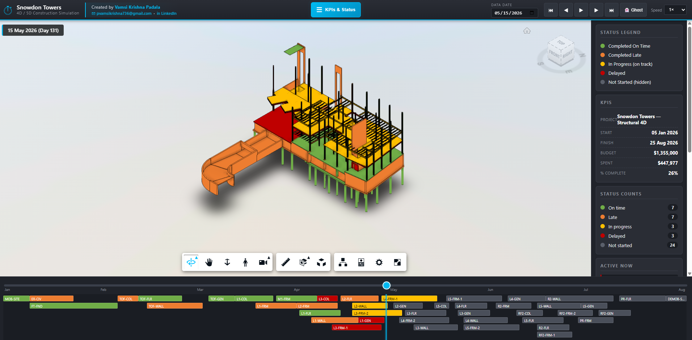

# Snowdon Towers — 4D / 5D Construction Simulation

Web-based 4D + 5D construction phasing simulation for the Snowdon Towers structural model. Built on Autodesk Platform Services (APS / Forge) Viewer.

🔗 **Live demo:** https://aps4d.vamsipadala.com



> Mid-May 2026 data date. Substructure complete (green), L1 walls completed late (orange), L2 framing in progress (yellow), some activities delayed (red). KPI sidebar + bottom Gantt strip update in real time as you scrub the timeline.

## Features

- **3D Viewer** — APS Viewer 7.x loads the translated SVF2 master view
- **4D Timeline** — 44 activities driven by Revit shared parameter `Custom 4D Phasing Set - ActivityID`
- **5-State Coloring** — Completed On Time (green) / Completed Late (orange) / In Progress (yellow) / Delayed (red) / Not Started (hidden)
- **5D Cost Tracking** — Budget vs Actual cost per trade and phase
- **Play / Pause / Step / Scrub** — full timeline control with 0.5×–10× speed
- **Editable Data Date** — set "today" to any date to see status snapshot
- **KPI Cards** — Budget, Spent, % Complete, status counts, active activities
- **Activity Strip** — mini-Gantt at bottom, click to isolate elements
- **Ghost Toggle** — show future elements as Navisworks-style outline
- **Mobile Responsive** — hamburger drawer sidebar, touch-friendly controls

## Tech Stack

- **APS Viewer** 7.x (Autodesk Platform Services)
- **Express** (local dev) / **Vercel serverless** (production)
- **Vanilla JS** — no framework
- **Modern CSS** — flexbox, media queries, no preprocessors

## Local Setup

```powershell
git clone https://github.com/YOUR-USERNAME/aps-4d-phasing-demo.git
cd aps-4d-phasing-demo
npm install
cp .env.example .env
# Fill .env with your APS Client ID + Secret
npm start
# Open http://localhost:3002
```

## Deploy to Vercel

1. Push to GitHub
2. Import repo on https://vercel.com
3. Set env vars: `FORGE_CLIENT_ID`, `FORGE_CLIENT_SECRET`
4. Deploy

## Credit

**Vamsi Krishna Padala** — BIM & Asset Data Manager
- Email: pvamsikrishna736@gmail.com
- LinkedIn: https://www.linkedin.com/in/vamsipadala/
